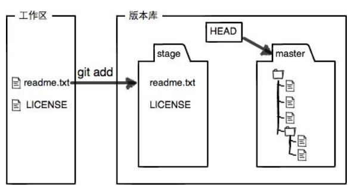

# 写在开头

**熟悉Linux的一些语法，有助与git的操作，在下面列出一些常用的Linux语法**

```
mkdir xxx //创建一个文件夹
touch xxx.txt //创建一个文件,以创建txt文件为例
cd file folde route    //进入某个文件夹下，Linux的根目录为'/',路径划分也使用斜杠
cd ..   //退回上一个路径
ls //查看文件列表
ll //比ls更加详细的查看列表信息
```

**LInux的编辑器也经常用到**

```
一般模式：使用vim/vi进入编辑器一般模式
编辑模式：按i/a键进入编辑模式，该模式仅输入内容，不能自动保存,按esc退回一般模式
命令模式：按shift+: 组合键进入命令模式，三种命令：q！不保存，强制退出；q 退出编辑器； wq 保存并退出编辑器
一些快捷键
一般模式下，复制并黏贴当前行：按yy复制当前行，再按p把复制内容黏贴到下一行
一般模式下，删除当前行：按dd删除一整行
一般模式下，撤销上次编辑内容：按u
命令模式下，查找关键词：输入:  :/<关键词名称>
命令模式下，显示或关闭行号：set number/nonumber
```


# Git学习笔记

## 初始化git仓库

- 在本地创建文件夹并进入，输入` git init`指令初始化你的git仓库
- 将GitHub、Gitee等远程仓库上的仓库克隆到本地，使用`git clone`命令

## 添加文件至Git仓库相关操作

- 使用`git add <filename>`命令将工作区的文件提交到Git的暂存区,或者将`<filename>`改成`.`将所有文件添加到暂存区  
- 使用`git commit -m <summary>`命令将暂存区文件添加到分支(即文件树)
- 如何理解Git的工作区,暂存区和分支,如下图所示:

- 使用` git status`查看工作区状态以及文件修改的内容

- 使用`git diff`查看文件修改内容

### Git版本控制相关操作

- 使用`git log`来查看Git的提交的历史记录,显示的是最近至最旧的操作记录
  - 在` git log`后面加上条件`--pretty=oneline`,可以详细的看到操作的时间线
  - 显示的一大串数字是`commit id`,十六进制数字组成,方便分布式工作
- Git使用`HEAD`指针控制版本,其中`HEAD`指向当前版本,`HEAD^`表示的是上一个版本,`HEAD^^`表示的是上上个版本,为了方便书写之前的n个版本写成`HEAD~n`
- Git 回退版本使用`Git reset --hard commit id` 命令,这个操作实际就是控制指针指向哪个`commit id`,`commit id`不用全部输入，只需输入前几位数，Git会自动查找
- 当你想要查询某个命令的`commit id`时,使用`git reflog`来查看之前一些操作的命令

### Git撤销修改

- **工作区撤销的作：**使用`git restore <<filename>> `,文件不仅要写文件名还要加上后缀名，该命令相当于将暂存区的文件回退到工作区，回到上一次`git add`
- **提交到暂存区而没有提交到分支的撤销操作：**`git restore --staged <<filename>>`可以把暂存区的修改回退到上一次commit之前，就是把当前HEAD内容回退到暂存区。
  - 更加详细的解释`git restore --source`,该命令可以指定从哪个源恢复内容到文件，例如直接从分支恢复文件到工作区：`git restore --source HEAD <filename>`
- **从分支撤销操作：** 参考上一节回退版本，使用`git reset --hard HEAD^`

### Git删除文件

- `git rm <filename>`命令删除一个文件，并提交到暂存区
  - 当你是误删时，可以使用上一节的`git restore --staged <filename>`恢复，但是未提交的修改会丢失（当然你可以去windows回收站看看🐶）

### Git远程仓库

- 连接远程仓库需要创建SSH key，SSH key是一种加密密钥，用于证明自己的身份，可以在C盘用户目录下看到.ssh目录，其中的`id_ras`和`id_rsa.pub`分别是自己的私钥和公钥。
- 没有SSH Key可以是使用`ssh-keygen -t rsa -C "email"`来创建自己的SSH Key
- 将SSH key中的公钥添加到Github或者Gitee即可将自己的本地分支上传到远程仓库
- **将本地仓库与远程仓库关联:**`git remote add origin git@Github.com:用户名/仓库名.git`
- **关联本地分支和远程分支：**`git push -u origin master` ,当第一次关联仓库后，需要使用本指令，之后可以省略`-u`参数
- **删除本地库与远程库关联：**`git remote rm origin`
- **查看本地库所关联的远程库的信息：**`git remote -v`

### Git分支管理

- 查看分支：`git branch`
- 创建分支：`git branch <name>`
- 切换分支：`git switch <name>`
- 创建并切换到该分支：`git switch -c <name>`
- 合并分支：`git merge <name>`
- 删除分支：`git branch -d <name>`，当你未合并该分支就想强制删除该分支：`git branch -D <name>`
- 当主分支和其他分支在相同地方有不同修改时，也可以使用`git status`查看冲突，发生冲突时无法合并分支，会报错，所以要手动解决冲突再合并分支。
- 合并分支图查看：`git log --graph`
- **Git的分支合并默认为`fast forward`模式，这样不利于长时间开发，所以有时需要禁用该模式：`git merge --no-ff -m <summary>`,使用该命令会保留原先的分支并且通过commit保留分支的`commit id`**

### 暂存内容

- 有时，你在当前分支工作未完成时，需要在新分支工作且并不能提交当前分支时，你需要暂存你的分支工作内容可以使用：`git stash`
- 当你想要恢复你的暂存内容时可以使用：`git stash apply`,注意，这仅仅会恢复你的暂存内容，但不删除这个暂存备份，你还需要使用`git stash drop`来删除stash内容。也可以使用便捷指令：`git stash pop`既恢复了stash内容也将其删除。
- 你可以有多个暂存内容，使用`git stash list`查看你暂存了哪些内容，并选择恢复哪个
- 多个stash恢复时使用`git stash apply stash@{0}`,其中的0是stash对应的编号，按情况修改。

### 复制commit提交到你的当前分支

多个分支工作时，你如果只想把之前分支的某个commit复制到当前分支，你可以使用`git cherry-pick commit id `,即可将特定的commit内容复制到当前分支

### 推送特定分支到远程

将本地分支推送到远程，推送当前分支你可以直接使用`git push`,当你要指定推送某个分支时使用`git push origin <branch-name>`


